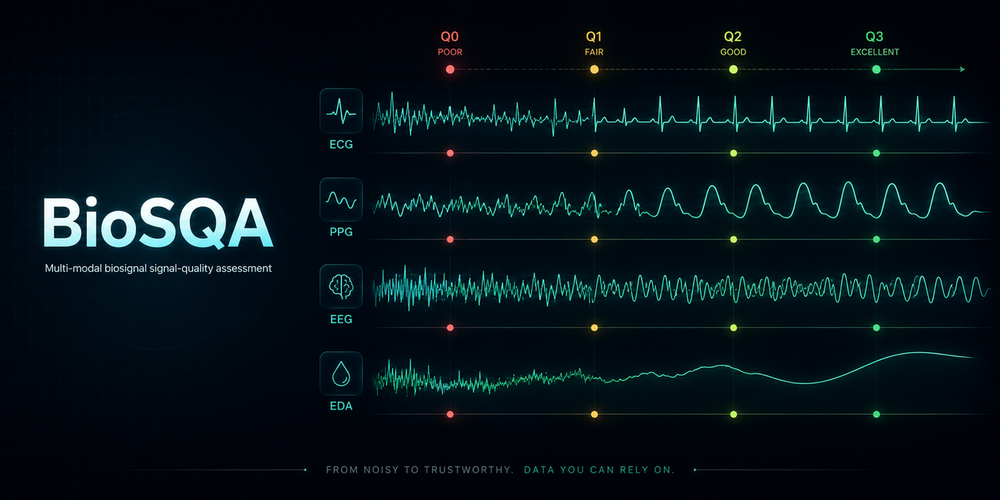

<p align="center">
  
</p>

# BioSQA Studio

**A desktop app for viewing biosignal recordings and overlaying automatic signal-quality assessment.**

BioSQA Studio opens ECG, PPG, EEG, and EDA recordings, detects the modality, runs a small
on-device neural quality model over a sliding window, and paints each segment with an ordinal
quality grade — so you can see, at a glance, which segments of a recording are trustworthy
and which are corrupted by motion, electrode noise, baseline wander, or dropout.

> **Bundled models: ECG and EDA.** All four signal types load, plot and export; quality
> grading needs a model in `models/`, and only these two can be redistributed under open
> terms. See [The quality models](#the-quality-models).

Built with **PySide6 (Qt 6) + QML**. Inference runs on the CPU via **ONNX Runtime** — no GPU,
no cloud, no training dependencies. The models are compact enough to score a window in a few
milliseconds.

**📖 Documentation:** [sokolmarek.github.io/biosqa](https://sokolmarek.github.io/biosqa/) — install,
the Q0–Q3 scale, every workspace, the model-card contract, runtime guards, explainability, and export.
The site source lives in [`docs/`](docs/) (Astro; deployed to GitHub Pages).

> ⚠️ **Not a medical device.** BioSQA Studio is a research/engineering tool for exploring signal
> quality. It is not certified for clinical or diagnostic use.

---

## The quality scale

Every window is graded on a 4-level ordinal scale:

| Grade | Meaning |
|------|---------|
| **Q3 — Excellent** | Usable for all analytics (morphology, HRV, …) |
| **Q2 — Acceptable** | Usable for rate/coarse features, not fine morphology |
| **Q1 — Poor** | Partially corrupted; usable only with caveats |
| **Q0 — Unacceptable** | Dominated by artifact; discard |

## Features

- **Open real recordings** — PhysioNet **WFDB** (`.dat`/`.hea`), the **EDF / BDF / GDF /
  BrainVision / EEGLAB / FIF** family (via MNE), and **Parquet**, opened **header-only** so a
  record of any length opens instantly.
- **Automatic modality detection** — ECG / PPG / EEG / EDA inferred from channel units, names and
  sampling rate; the matching quality model is loaded automatically. Detection runs as a background
  check even when you pick the type manually, and warns if the header disagrees.
- **Sliding-window quality inference** — the signal is scored window-by-window on the CPU and
  collapsed into contiguous quality segments (run-length overlay on the trace).
- **Scales to long recordings** — very long records (multi-hour/day) are analysed **out-of-core**:
  inference streams in blocks and the trace is decimated block-wise, so the whole signal is never
  held in memory. (Streamed records skip the recoverability + false-clean passes, which need a
  whole-signal view.)
- **Recoverability** — a second pass on a filtered copy flags poor windows a standard filter would
  likely make usable (advisory; for ECG/PPG corroborated by a filter-robust bSQI).
- **Multi-channel** — toggle channels on to view them as stacked lanes.
- **Edit the segmentation** — trim a segment boundary, split, merge, or reclassify a piece.
- **Overview + navigation** — a whole-record quality strip, per-segment inspector, and
  click-to-select drill-down into any region.
- **Manual review** — relabel a segment or attach a note; the corrected grade, the model's
  original grade, and the note all export together.
- **Export** — quality segments, corrections & notes to **CSV**, **TSV** (BIDS events), **JSON**,
  **Parquet**, **WFDB** annotations, or **MATLAB** `.mat`.
- **Sample data included** — a `dummy_data/` folder of small ECG / PPG / EEG / EDA WFDB recordings
  lets you run the full pipeline (open → infer → overlay → export) without a recording of your own.

## Install

Requires **Python ≥ 3.10** (3.12 recommended). From the repository root:

```bash
cd app
python -m venv .venv
# Windows:  .venv\Scripts\activate
# Unix:     source .venv/bin/activate
pip install -e .
```

## Run

```bash
biosqa-studio          # installed GUI entry point
# or, equivalently:
python -m biosqa.main
```

No recording handy? Use **Open recording ▾** and pick one of the small sample files in the app's
`dummy_data/` folder to watch the full quality pipeline run end-to-end.

## The quality models

The app consumes two artifacts per modality from `models/`:

- `models/<modality>.onnx` — an FP32 quality model (input `float32[1, 1, L]`).
- `models/<modality>.model_card.json` — the preprocessing/normalization contract
  (`fs_hz`, window length, class order, normalization constants, feature spec, version).

On load, the model card's schema is validated and **its** normalization is applied — never
constants hard-coded in the app. A missing or mismatched card is a **hard failure at load
time** (loud, not silent): silently-different preprocessing between training and inference is
the number-one way this kind of system quietly degrades.

**Two models ship in `models/`: `ecg` and `eda`.** Both were trained exclusively on datasets
whose published terms are open and attribution-based, so their weights can be redistributed
with the app. EEG and PPG are fully supported signal types — they load, plot, and export — but
their weights are **not** bundled, because those models were trained on credentialed-access
(MIMIC-III), non-commercial (WESAD) and data-use-agreement (TUAR) cohorts whose terms an
openly-licensed release would not honour. Opening such a recording shows the signal and reports
that no model is bundled for that modality; supply your own conforming pair in `models/` and it
works with no code change. See [`LICENSE-MODELS`](LICENSE-MODELS) for the per-dataset reasoning.

The models are produced by a separate research/training pipeline (not part of this repository)
and exported to the ONNX contract above — the app never imports training code and has no
training dependencies.

### Input contract & pre-filtering

The models are trained on **raw** signals and report the quality of the signal **as provided**. If a
source device has already filtered the signal, an aggressive low-pass/band-limit can strip the
high-frequency cues the model relies on *faster* than it restores a usable signal — so a still-corrupted
signal may be scored as clean (a "false-clean" failure). To guard against this, the app runs
`biosqa.inference.prefilter.detect_prefiltering()` on each window: a few-microsecond spectral-fingerprint
check that flags likely pre-filtering (suppressed high-frequency band, mains notch) so the UI can warn
that the quality score may be optimistic. Feed **raw** recordings for the most reliable assessment.

## Project layout

```
app/
  biosqa/
    main.py          # QApplication + QQmlApplicationEngine bootstrap
    ui/              # QML presentation tree
    viewmodels/      # Qt models/controllers bound to QML (Coordinator wires open→infer→overlay)
    scenegraph/      # custom decimated-trace renderer (QQuickItem)
    io/              # lazy WFDB/EDF loaders, decimation pyramid, LRU cache, modality detection
    inference/       # ONNX Runtime runner, preprocessing, quality segmenters, feature packs
    model/           # model_card.json parsing + validation
    workers/         # off-thread inference (QThreadPool)
    export/          # CSV / TSV / JSON / Parquet / WFDB / MAT exporters
  models/            # shipped <modality>.onnx + .model_card.json (ecg, eda)
  dummy_data/        # small sample WFDB recordings (ECG / PPG / EEG / EDA)
  tests/             # unit tests (io / inference / model)
  docs/              # the documentation + landing site (Astro → GitHub Pages)
  reproducibility/   # ML paper reproducibility — model architectures, training, eval, ONNX export
```

The **`reproducibility/`** folder is a self-contained reference release of the ML experiments behind the
models — the network architectures, the training loop, the frozen eval harness, and the ONNX export — with a
synthetic-data smoke run that needs no dataset. See [`reproducibility/README.md`](reproducibility/README.md).
It is torch-based research code, kept deliberately separate from the torch-free desktop app.

## Status & scope

The core pipeline — **open a WFDB/EDF recording → detect modality → run the quality model →
overlay segments → inspect → export**, plus the synthetic-signal demo — works end-to-end, and
the framework-agnostic pieces (loaders, decimation, segmenters, model-card validation, the
runtime guards, and settings) are unit-tested (`pytest`, 400+ tests, run in CI on Linux + Windows).
Some formats beyond WFDB/EDF (e.g. Zarr/Parquet ingestion) are still in progress. The standalone
frozen build (`pyinstaller build/biosqa.spec`) is validated on **Windows** — it launches and runs;
the macOS/Linux release jobs and a bare-machine (no-Python) test are not yet proven. Contributions
and issues welcome.

## Datasets

The biosignal signal-quality models in this project were trained on the public datasets below, grouped by modality. Each entry notes its role (native quality labels, quality *derived* from adjacent annotations, or a calibrated clean/noise source). All PhysioNet datasets additionally fall under the umbrella PhysioNet citation: Goldberger et al. (2000), *Circulation* 101(23):e215–e220, https://doi.org/10.1161/01.CIR.101.23.e215.

This list is the **ingested** corpus — every entry has a loader and appears in a built training store. It is not a per-model list: which cohorts each shipped model actually trained on, and what access terms those carry, is recorded per model in [`LICENSE-MODELS`](LICENSE-MODELS) and in the `training_data_provenance` block of its model card.

### ECG
- **PhysioNet/CinC Challenge 2011** — native binary acceptable/unacceptable labels per 10-s 12-lead record; Silva, Moody & Celi (2011), *Computing in Cardiology* 38:273–276. PhysioNet: `challenge-2011`, https://physionet.org/content/challenge-2011/.
- **BUT QDB (Brno University of Technology ECG Quality Database)** — native 3-class (good/usable/unusable) expert quality annotations; Nemcova et al. (2020), PhysioNet. https://doi.org/10.13026/kah4-0w24.
- **European ST-T Database (EDB)** — native per-channel 3-class quality codes via NOISE annotations; Taddei et al. (1992), *European Heart Journal* 13(9):1164–1172. PhysioNet: `edb`.
- **MIT-BIH Malignant Ventricular Ectopy Database (VFDB)** — derived quality (NOISE episode code) / secondary clean source; Greenwald (1986), M.S. thesis, MIT. PhysioNet: `vfdb`.
- **MIT-BIH Noise Stress Test Database (NSTDB)** — calibrated-SNR noise source; Moody, Muldrow & Mark (1984), *Computers in Cardiology* 11:381–384. PhysioNet: `nstdb`.
- **MIT-BIH Supraventricular Arrhythmia Database (SVDB)** — derived quality / clean source; Greenwald (1990), Ph.D. thesis, Harvard–MIT HST. PhysioNet: `svdb`, https://doi.org/10.13026/C2V30W.
- **PTB-XL** — derived quality from per-record noise/artifact flags; also a clean-signal source; Wagner et al. (2020), *Scientific Data* 7:154, https://doi.org/10.1038/s41597-020-0495-6. PhysioNet: `ptb-xl`.

### EEG
- **TUAR (TUH EEG Artifact Corpus)** — native per-channel, per-interval artifact-type annotations; Obeid & Picone (2016), *Frontiers in Neuroscience* 10:196, https://doi.org/10.3389/fnins.2016.00196. Access: https://isip.piconepress.com/projects/nedc/ (**registration / data agreement required**).
- **Motion Artifact Contaminated fNIRS + EEG (EEG portion)** — derived quality; Sweeney et al. (2012), *IEEE Trans. Inf. Technol. Biomed.* 16(5):918–926, https://doi.org/10.1109/TITB.2012.2207400. PhysioNet: `motion-artifact`.
- **PhysioMotion Artifact EEG** — native point-wise expert artifact markers; OpenNeuro: `ds006386`, https://doi.org/10.18112/openneuro.ds006386.v1.0.1 (CC0).
- **Phantom EEG (iCanClean)** — isolated-artifact type-calibration anchor; Downey & Ferris (2023), *Sensors* 23(19):8214, https://doi.org/10.3390/s23198214. OpenNeuro: `ds004784`, https://doi.org/10.18112/openneuro.ds004784.v1.0.4 (CC0).
- **Mind in Motion (uneven-terrain walking EEG)** — condition-derived quality; Liu et al. (2024), *Imaging Neuroscience*, https://doi.org/10.1162/imag_a_00097. OpenNeuro: `ds004625` (CC0).

### PPG
- **BUT PPG (BUT Smartphone PPG Database)** — native binary good/poor quality per 10-s record; Nemcova et al. (2021), *BioMed Research International* 2021:3453007, https://doi.org/10.1155/2021/3453007. PhysioNet: `butppg`.
- **PPG-DaLiA** — derived quality from synchronized wrist-accelerometer motion; Reiss et al. (2019), *Sensors* 19(14):3079, https://doi.org/10.3390/s19143079. UCI ML Repository: `PPG-DaLiA`.
- **WESAD (wrist PPG)** — derived quality from synchronized wrist-accelerometer motion; Schmidt et al. (2018), *ICMI '18*, https://doi.org/10.1145/3242969.3242985 (**research use; the dataset's terms exclude commercial use**).
- **MIMIC-III-Ext-PPG** — native per-10-s SQI codes; a MIMIC-III derivative on PhysioNet (**credentialed access / signed data use agreement required**).

### EDA
- **EDA-Artifact-Detection (UTD + AWW)** — native binary artifact labels per 5-s window (3-expert vote); Zhang, Haghdan & Xu (2017), *ISWC '17*, arXiv:1707.08287. Source data: UT Dallas stress set (Birjandtalab et al., 2016, *IEEE SiPS*) and Alan Walks Wales (https://alanwalks.wales/data/).
- **EDABE** — native per-sample binary expert artifact mask; Llanes-Jurado et al. (2023), *Expert Systems with Applications* 230:120581, https://doi.org/10.1016/j.eswa.2023.120581. Dataset: Zenodo, https://doi.org/10.5281/zenodo.7248134.
- **WESAD (wrist EDA)** — derived quality from wrist-accelerometer motion; Schmidt et al. (2018), *ICMI '18*, https://doi.org/10.1145/3242969.3242985 (**research use; the dataset's terms exclude commercial use**).
- **PPG-DaLiA (EDA)** — derived quality from wrist-accelerometer motion; Reiss et al. (2019), *Sensors* 19(14):3079, https://doi.org/10.3390/s19143079. UCI ML Repository: `PPG-DaLiA`.

## Acknowledgements & licenses

The **app source code** is released under the **MIT License** (see [`LICENSE`](LICENSE)).

**The MIT license does not cover the model weights.** The four `.onnx` files in `models/` are
derived from the datasets listed above, and some of those carry access or use restrictions that
the weights inherit — **TUAR** (signed Temple data use agreement), **MIMIC-III-Ext-PPG**
(PhysioNet credentialed access), **WESAD** (research use, no commercial use). Per-model
provenance and the inherited terms are in [`LICENSE-MODELS`](LICENSE-MODELS), and machine-readably
in the `license` block of each `models/<modality>.model_card.json`. That file is a provenance
statement, not legal advice: check each source's current terms before redistributing the weights
or using them commercially. No dataset is redistributed with the app.

The app builds on: **Qt / PySide6** (LGPLv3), **ONNX Runtime** (MIT), **wfdb** (MIT) and **MNE**
(BSD-3) for reading recordings, **NumPy / SciPy**, **Zarr**, and **PyArrow**. Bundled UI fonts
retain their own licenses. Each dependency is governed by its respective license.
